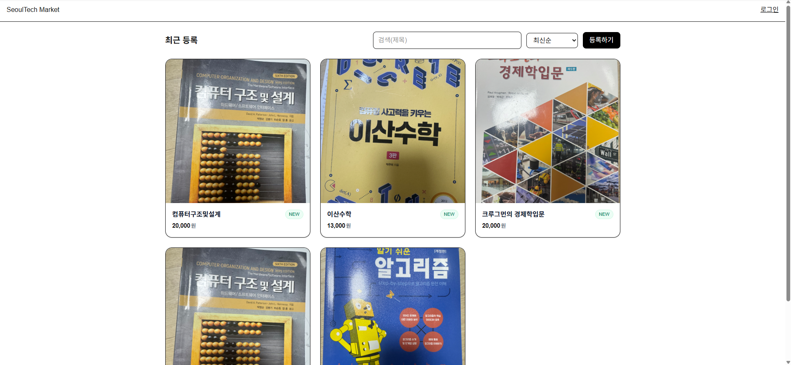

# SeoulTech Market

> 서울과기대 학생들을 위한 간단한 중고거래 웹앱. **Next.js(App Router) + Supabase**로 로그인(매직링크), 상품 등록/목록/검색/정렬, 상세 보기, 댓글(거래 문의)까지 구현했습니다.

<p align="center">
  
</p>

<div align="center">

[](#) [](#) [](#) [](#)

</div>

---

## ✨ 데모

- **Live**: `https://seoultech-market.vercel.app`
- 테스트 방법
  1) 상단 `로그인` → 이메일 입력 → 메일의 **Magic Link** 클릭  
  2) `등록하기`에서 상품 등록(제목/가격/설명/이미지)  
  3) 메인에서 **검색/정렬** 사용 및 **카드 클릭 → 상세/댓글 작성**

> 배포는 **Vercel**, 데이터/인증/파일은 **Supabase**를 사용합니다.

---

## 🔥 주요 기능

- **이메일 매직링크 로그인** (Supabase Auth)
- **상품 등록**: 이미지 Storage 업로드 + DB insert (RLS 적용)
- **상품 목록**: 최신순 / 가격 오름차순 / 가격 내림차순 정렬 + 제목 검색
- **상품 상세**: 이미지/제목/가격/설명/등록일 표시
- **댓글(문의)**: 로그인 사용자 누구나 작성, 작성자 이메일 노출
- **RLS**: insert에 `auth.uid()` 제약, Storage 업로드 정책

<p align="center">
  
</p>

---

## 🧱 기술 스택 & 아키텍처

- **Frontend**: Next.js(App Router, CSR 중심), React, TypeScript, Tailwind(기본 유틸)
- **Backend(BaaS)**: Supabase (PostgreSQL, Auth, Storage)
- **Infra**: Vercel (Preview/Production), Supabase 프로젝트
- **구조**
  ```txt
  src/
    app/
      (routes)
      auth/          # 로그인/로그아웃/콜백
      items/[id]/    # 상세 페이지 (CSR + Supabase)
      sell/          # 등록 페이지
      page.tsx       # 메인 목록/검색/정렬
      layout.tsx
    components/
      AuthCallback.tsx
      ItemDetailClient.tsx
    lib/
      supabaseClient.ts  # 클라이언트 초기화
  ```

---

## 🗄️ DB 스키마

```sql
-- items
create table if not exists public.items (
  id          uuid primary key default gen_random_uuid(),
  seller_id   uuid not null,
  title       text not null,
  price       integer not null check (price >= 0),
  description text,
  image_path  text,
  created_at  timestamptz not null default now()
);

-- comments
create table if not exists public.comments (
  id           uuid primary key default gen_random_uuid(),
  item_id      uuid not null references public.items(id) on delete cascade,
  author_id    uuid not null,
  author_email text,
  content      text not null,
  created_at   timestamptz not null default now()
);
```

### Row Level Security (RLS) & 정책 예시

```sql
-- RLS 활성화
alter table public.items enable row level security;
alter table public.comments enable row level security;

-- 누구나 목록/상세 조회 허용(데모 용도)
drop policy if exists items_select_all on public.items;
create policy items_select_all on public.items
for select using (true);

drop policy if exists comments_select_all on public.comments;
create policy comments_select_all on public.comments
for select using (true);

-- 로그인한 사용자만 자신의 상품 insert 허용
drop policy if exists items_insert_own on public.items;
create policy items_insert_own on public.items
for insert with check (auth.uid() = seller_id);

-- 누구나 댓글 insert 허용(작성자 정보는 클라에서 전달)
drop policy if exists comments_insert_all on public.comments;
create policy comments_insert_all on public.comments
for insert with check (true);
```

### Storage 정책 (버킷: `item-images`)

```sql
-- 인증 사용자만 업로드
drop policy if exists "upload to item-images for authenticated" on storage.objects;
create policy "upload to item-images for authenticated"
on storage.objects for insert to authenticated
with check (bucket_id = 'item-images');

-- 공개 읽기
drop policy if exists "read item-images" on storage.objects;
create policy "read item-images"
on storage.objects for select to public
using (bucket_id = 'item-images');
```

---

## ⚙️ 환경 변수

Vercel/Supabase 둘 다 같은 키를 사용합니다.

```bash
# .env.local
NEXT_PUBLIC_SUPABASE_URL="https://<your-project>.supabase.co"
NEXT_PUBLIC_SUPABASE_ANON_KEY="<public-anon-key>"
```

> **주의**: 키는 클라이언트에서 사용되는 **public anon key**입니다. (service role 금지)

---

## 🧑‍💻 로컬 개발

```bash
# 1) 의존성
npm i

# 2) 개발 서버
npm run dev
# http://localhost:3000
```

- Supabase 프로젝트를 생성하고 **URL / anon key / Storage 버킷 / SQL**을 위 스키마/정책대로 설정
- 첫 로그인 시 메일의 **Magic Link**로 인증

---

## 🧪 구현 상세

- **로그인 처리**: `/auth/confirm`에서 해시/코드 콜백을 감지, `supabase.auth.exchangeCodeForSession()` 처리
- **상품 등록**: `sell/page.tsx`  
  1) 파일을 `item-images/${userId}/${timestamp}-${file.name}`로 업로드  
  2) `items`에 `seller_id/title/price/description/image_path` insert  
  3) 성공 시 `/items/[id]`로 이동
- **목록/검색/정렬**: 메인 `page.tsx`에서 Supabase로 fetch → 클라이언트에서 제목 검색, 서버 정렬 옵션(최신/가격)
- **상세/댓글**: `ItemDetailClient.tsx`에서 해당 id로 `items` 1건 + `comments` 목록 조회, 댓글 작성(insert) 지원

---

## 🧩 체크리스트(평가 대응)

- [x] **아이디어/창의성**: 학내 특정 타깃(서울과기대) 중고거래로 좁혀 기능 최소집합 구현
- [x] **완성도**: 로그인 → 등록 → 목록/검색/정렬 → 상세/댓글의 **엔드투엔드 플로우** 동작
- [x] **난이도**: Supabase RLS/Storage 정책, 해시/코드 콜백 처리, 이미지 업로드/퍼블릭 URL 사용
- [x] **README 충실도**: 스키마/정책/환경변수/로컬 실행/배포/구조/스크린샷
- [x] **오픈소스 공개 / 라이선스**: MIT

---

## 📂 프로젝트 구조 (요약)

```txt
src/app/
  page.tsx               # 목록/검색/정렬
  layout.tsx             # 공통 헤더
  sell/page.tsx          # 상품 등록
  items/[id]/page.tsx    # 상세 페이지 (클라 컴포넌트 사용)
  auth/page.tsx          # 로그인(메뉴)
  auth/confirm/page.tsx  # 콜백 처리
  me/page.tsx            # 세션 확인(디버그)
src/components/
  AuthCallback.tsx
  ItemDetailClient.tsx
src/lib/
  supabaseClient.ts
```

---

## 🗓️ 로드맵(선택)

- [ ] 판매 상태(판매중/예약중/거래완료) 표시
- [ ] 나의 상품/댓글 관리(수정·삭제)
- [ ] 서버 캐시/ISR 도입, 이미지 썸네일 최적화
- [ ] 신고/차단, 알림 메일

---

## 🙏 참고

- Supabase Docs, Next.js Docs
- 이미지/스크린샷은 `docs/` 폴더 참고(직접 캡처 후 교체)

---

## 📄 라이선스

MIT © 2025 김준엽
